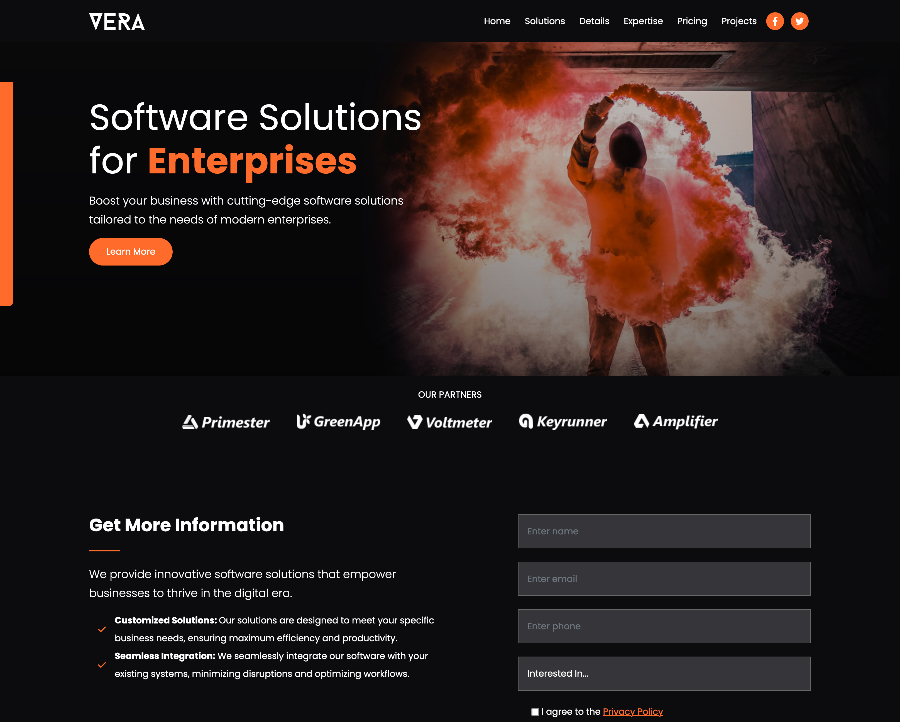

#  Vera Website

Bootstrap Business website for software solutions, but could easily be changed to fit any business. Dark-themed design with modals and other features.

## Screenshot

## Link

- Live Site URL: [https://andrewteece.github.io/vera-website/]

### Built with

- Semantic HTML5 markup
- CSS custom properties
- Flexbox
- Bootstrap
- SASS/SCSS
- JavaScript
- Font Awesome
- Mobile-first workflow

## Features

- Dark design with bright buttons & text for contrast
- Responsive design
- Script for rolling words
- Navbar scroll effect
- Video modal
- Animated play button
- Pricing grid
- Styled modals for projects
- Font awesome icons

